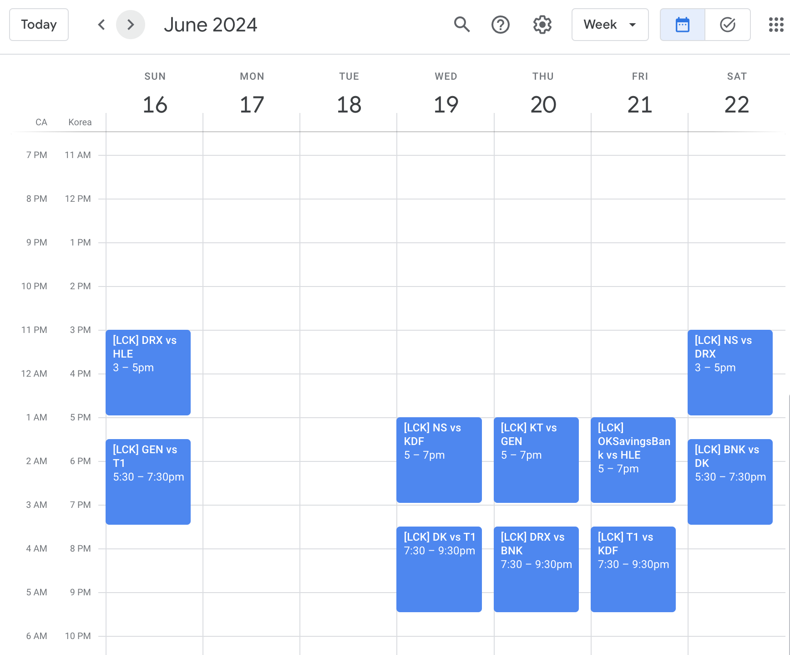
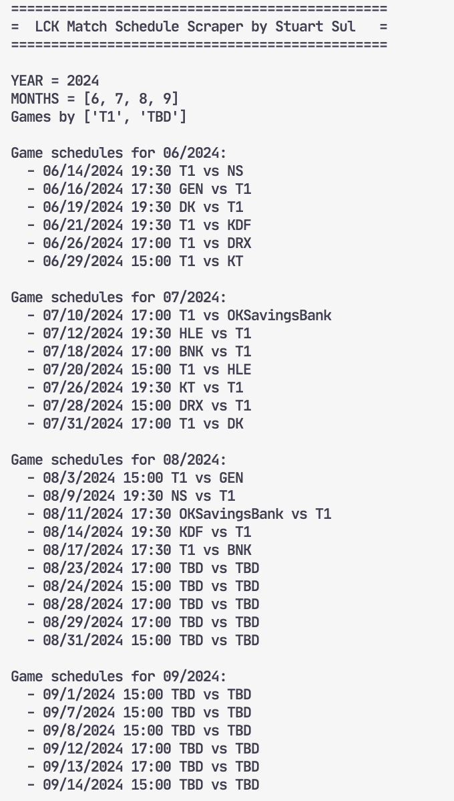

# LCK Match Schedule Scraper

This repository contains a simple Python script which scrapes LCK([League of Legends Champions Korea](https://en.wikipedia.org/wiki/League_of_Legends_Champions_Korea)) match schedules from [NAVER E-Sports](https://game.naver.com/esports/League_of_Legends/schedule/lck) webpages. It then saves all the events as a `*.ics` file which can be imported to various calendar services such as Google Calendar.

## Screenshots

What it looks like after being imported to Google Calendar:



What it looks like on terminal:



## How to use

First, install dependencies through the Python package manager:

```bash
pip install -r requirements.txt
```

Then, set the following variables in `config.py`:

- `YEAR`, `MONTHS`: These variables determine the time range from which games are scraped. For instance, if you want to extract all LCK Summer 2024 games, you should set `YEAR = 2024` and `MONTHS = [6, 7, 8, 9]`.
- `EXTRACT_ALL_TEAMS`: Setting this to `False` will extract games from specified teams only. Set to `True` if you want to scrape all games.
- `TEAMS`: Only valid if `EXTRACT_ALL_TEAMS = False`. For instance, you can set it to `['T1']` to extact T1 games only. If you want to also include the to-be-determined games (ex. playoffs), include `TBD`. Note that this should be the proper team name abbreviation in English. If you are not sure, run the script with `EXTRACT_ALL_TEAMS = True` to see the official name abbreviations.

Finally, run the script:

```bash
python main.py
```

This will generate a file named `schedules.ics` which you can import to various calendar services such as Google Calendar.
